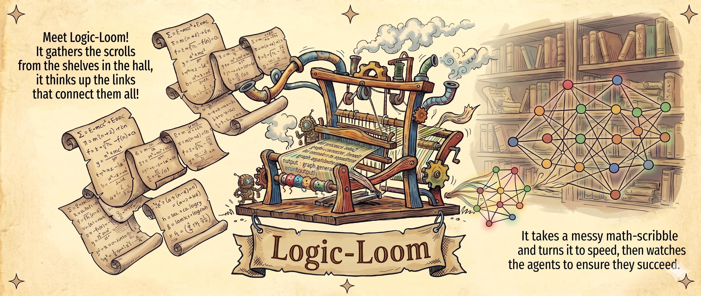

# Meet The Logic-Loom

> *It gathers the scrolls from the shelves in the hall, it thinks up the links that connect them all!*
>
> *It takes a messy math-scribble and turns it to speed, then watches the agents to ensure they succeed.*

Public home for downloadable Logic-Loom builds, release notes, install instructions, checksum manifests, and known issues.

Logic-Loom is a desktop companion for the [zotero-summarizer](https://github.com/SOSOVSKI/zotero-summarizer) workflow, with optional [AKMS](https://github.com/SOSOVSKI/AKMS) integration for batch selection, node validation, and graph exploration.

## Download

- Latest release: <https://github.com/CEmM2/Logic-Loom-releases/releases/latest>
- All releases: <https://github.com/CEmM2/Logic-Loom-releases/releases>

Release binaries live in **GitHub Releases**, not in the private implementation repository.

## What lives in this repo

- `docs/` — public product docs, install guidance, AKMS/zsum context, and release workflow notes
- `release-notes/` — draft and published release notes by version
- `checksums/` — checksum manifests and verification guidance

## Start here

- [Logic-Loom overview](docs/logic-loom.md)
- [Install instructions](docs/install.md)
- [zotero-summarizer guide](docs/zotero-summarizer.md)
- [AKMS integration guide](docs/akms.md)
- [Known issues](docs/known-issues.md)
- [GitHub Releases workflow](docs/github-releases.md)

## What the app includes

- Tauri desktop shell and React frontend
- Bundled `logic-loom-api` Python sidecar
- Bundled `zotero-summarizer` package and its Python runtime dependencies
- Pipeline log streaming, vault browsing, and release-focused desktop UX
- Optional AKMS-gated tabs when compatible AKMS resources are available

## What you still need

- Zotero
- Better BibTeX JSON export
- Access to your local PDFs
- An LLM backend or CLI such as Ollama, LM Studio, an OpenAI-compatible endpoint, Claude CLI, Codex CLI, or Gemini CLI
- AKMS repo/vault setup only if you want AKMS-specific workflows

## Current release status

- Early alpha / pre-release quality
- Platform assets may vary by release
- macOS Gatekeeper and Windows SmartScreen warnings are expected until signing/notarization is added
- Some onboarding flows still expose expert-oriented configuration fields inherited from the underlying research tooling
